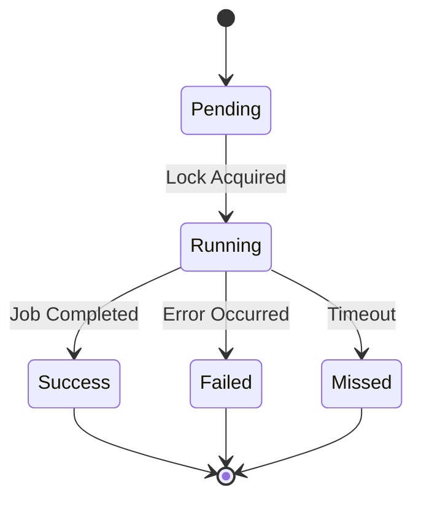

# PART 020: Reliability & Operability Foundation

## Goal
建立系統可靠性與可操作性基礎，修復已知漏洞（B7/B10/W1/W2/M2），並為 part-021 的常駐 Supervisor 與 Watchdog 守護行程鋪路。

## Non-goals
- 不實作 part-021 的常駐 daemon、Supervisor、Watchdog 或既有 task cutover。
- 不遷移、停用或接管目前的 scheduler / hidden VBS task launches。
- 不新增 job-control UI；Dashboard 僅限既有介面的可靠性與安全性修補。
- part-020 目前是 planned、不可執行；本次文件準備批次不修改 runtime code、schema 或 tests，也不宣稱修復任何 issue。
- 未來各 implementation slice 只有在各自 promotion 進 `.beacon/CURRENT.md` 後才可執行，並可依其 Files-scope 修改 runtime code、schema migration 與 tests。

## Assumptions
- part-019 仍是唯一可執行的 CURRENT。
- part-020 必須在 part-021 實作前完成。
- 目前的 6 個隱藏 VBS task launches 是過渡性的。
- 使用者已決定在基礎建設完成後，採用 daemon + 單一 watchdog 架構。

## Design Options

### 1. `job_runs` Table
- **Option A**: 擴充現有的 `agent_runs` 表。
  - *Pros*: 減少新表數量。
  - *Cons*: `agent_runs` 是 invocation-level，無法表達 schedule/lock/missed-run 語意。
- **Option B**: 新增 `job_runs` 表。
  - *Pros*: 職責分離，能精確表達排程任務的狀態。
  - *Cons*: 增加 schema 複雜度。

### 2. DB Path Safety (B7/B10)
- **Option A**: 在 `connect()` 強制檢查路徑。
  - *Pros*: 簡單直接。
  - *Cons*: 可能影響初始化流程。
- **Option B**: 引入 `require_exists` 參數，並在內部模組強制傳遞 `db`。
  - *Pros*: 靈活且安全。
  - *Cons*: 需要修改多處呼叫。

### 3. Dashboard Hardening (W1/W2/M2)
- **Option A**: 在現有 `http.server` 上增加防禦。
  - *Pros*: 保持輕量。
  - *Cons*: `http.server` 本質上不適合生產環境。
- **Option B**: 遷移至更強健的框架（如 FastAPI）。
  - *Pros*: 內建防禦機制。
  - *Cons*: 增加依賴，違反「零依賴」原則。

## Chosen Design

### 1. `job_runs` Table
選擇 **Option B**。`job_runs` 將是一張新表，用於記錄排程任務的狀態。本次文件準備批次不做 migration；未來 promoted slice-004 負責 DB1 migration、`core/stm.py` API 與相關 tests。

### 2. DB Path Safety (B7/B10)
選擇 **Option B**。在 `connect()` 引入 `require_exists` 參數，並在內部模組強制傳遞 `db`。

### 3. Dashboard Hardening (W1/W2/M2)
選擇 **Option A**。在現有 `http.server` 上增加防禦：
- W1: 增加 Content-Length 邊界檢查，拒絕過大請求並回傳 400 Bad Request。
- W2: 確保 `idx_db` 正確傳遞。
- M2: 引入結構化 outcome 欄位。

## Flow/State Diagrams

## Verification Targets
- 確認 `job_runs` 的設計符合需求。
- 確認 DB Path Safety 的設計能解決 B7/B10。
- 確認 Dashboard Hardening 的設計能解決 W1/W2/M2。

## Unit Test Strategy
- 針對 `job_runs` 的狀態轉換撰寫測試。
- 針對 DB Path Safety 撰寫邊界測試。
- 針對 Dashboard Hardening 撰寫惡意輸入測試。

## Operational-Probe Strategy
- 撰寫探針腳本模擬惡意 `Content-Length`。
- 撰寫探針腳本模擬錯誤的 DB 路徑。

## Risks
- `job_runs` 的引入可能增加系統複雜度。
- Dashboard Hardening 可能影響現有功能。

## Open Questions
- `job_runs` 的具體 schema 應包含哪些欄位？
  - *Resolution*: 必須包含 job identity, correlation/run id, planned/actual time, status, exit/error, duration, log pointer, last success/next expected。

## Roadmap Reconciliation Closure
- part-020 完成後，將為 part-021 的常駐 Supervisor 與 Watchdog 守護行程奠定基礎。
- 確保非破壞性備份/還原演練與 RPO/RTO 達標。
- 建立結構化 job observability 契約。
