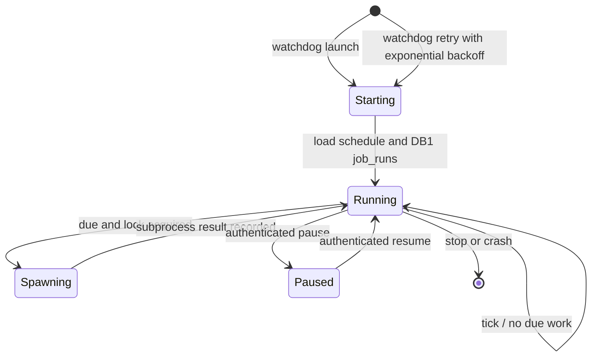

# part-021: Resident Daemon Control Center

> Status: planned (non-executable)
> Created: 2026-07-31
> Parent: part-020 Reliability & Operability Foundation
> Execution authority: none until an individual slice is promoted into `.beacon/CURRENT.md`; part-019 remains the only executable CURRENT.

## 1. Goal

Replace the transitional seven Windows Task Scheduler definitions (six domain jobs plus the dashboard ONSTART task) with one resident daemon and one liveness-only watchdog. The daemon provides deterministic scheduling, overlap prevention, DB1-backed status, and a loopback control surface for the existing dashboard without absorbing domain business logic.

## 2. Preconditions

- part-020 must be completed and archived before any part-021 slice is promoted.
- DB1 `job_runs` delivered by part-020 is authoritative for run locks, planned/actual timing, status, exit/error, duration, log pointer, last success, and next expected run.
- The seven current Task Scheduler definitions and their XML exports must be inventoried before cutover.
- This DESIGN and TODO are planning artifacts only. They do not authorize runtime, scheduler, manifest, or `.beacon/CURRENT.md` changes.

## 3. Non-goals

- No conversational state or LLM context in the daemon.
- No domain business logic in the daemon; it schedules and spawns existing CLI jobs.
- No arbitrary command execution; job identifiers resolve through a static allowlist to existing `python -m core.agent --job <name>` commands.
- No new write bypass. Trusted internal jobs preserve their own deterministic validated write paths. User- or agent-initiated proposal mutations remain subject to `writer.py` validation and confirmation. The daemon only starts existing CLI entry points and cannot apply proposals, issue raw SQL, or alter those boundaries; the daemon adds no bypass.
- No replacement of DB1 `job_runs` with daemon-local JSON, process memory, or log-file authority.
- No implementation during this design repair.

## 4. Chosen Architecture

### 4.1 Supervisor and Job Execution

- `core/daemon.py` is a new resident supervisor with a deterministic schedule table for the six existing domain jobs: `remind`, `consolidate`, `curate`, `track`, `scout`, and `advise`.
- Each due job is spawned as an independent existing CLI subprocess. A domain job crash cannot execute arbitrary code or terminate the scheduling loop.
- The daemon derives lock and status decisions from DB1 `job_runs`; it does not use PID files as the authoritative lock.
- A run is acquired atomically through the part-020 `job_runs` API before subprocess spawn. If the same job already owns a live lock, the due attempt is recorded as skipped/overlap according to the part-020 status contract and is not spawned.
- Subprocess completion updates the same run record with actual time, status, exit/error, duration, log pointer, last success, and next expected run.

### 4.2 Deterministic Missed-run Policy

- Each job has a configured interval or wall-clock schedule and a configured grace duration.
- On daemon start, calculate lateness from the authoritative next expected run in DB1.
- If lateness is less than or equal to the configured grace, run that job exactly once at startup after acquiring its DB1 lock, then calculate the next future interval. Do not replay every missed occurrence.
- If lateness is greater than the configured grace, record one missed result (`missed`) in `job_runs` and wait for the next interval; do not launch a catch-up run.
- Repeated scheduler ticks are idempotent because the planned run identity and DB1 lock prevent duplicate spawn.

### 4.3 Watchdog Contract

- One Windows Task Scheduler watchdog runs every **60 seconds**.
- It performs only daemon liveness detection and launch. It never schedules or invokes domain jobs and never hosts dashboard logic.
- Restart attempts use exponential backoff persisted outside the repo so repeated daemon failures cannot create a tight launch loop. A successful liveness check resets the backoff.
- After final cutover, the watchdog is the only remaining Metatron Task Scheduler definition.

### 4.4 Dashboard Control Security

- Dashboard and daemon bind to loopback only.
- State-changing daemon controls require a cryptographically random per-install bearer token generated during installation and stored outside the repository under `DATA_DIR` with user-only access; the token is never committed or rendered into page source.
- Every state-changing request validates the token, rejects an invalid `Host`, and validates `Origin` against the exact configured loopback dashboard origin. Missing or mismatched security inputs fail closed.
- Controls are allowlisted operations only: trigger one named domain job, pause scheduling, and resume scheduling. Trigger still acquires the authoritative DB1 lock. Pause prevents new scheduled starts but does not kill an active subprocess.
- User/agent proposal mutations reached through existing dashboard capabilities continue through writer+confirm; daemon controls do not create an alternate mutation path.

### 4.5 Observability

- Dashboard status is read from DB1 `job_runs`, not scraped from process output.
- The read-only view exposes job identity, planned/actual time, current status, last success, next expected run, duration, and a bounded log pointer/detail.
- Daemon health and pause state may be exposed separately, but cannot override historical DB1 run records.

### 4.6 Cutover and rollback

- `tools/cutover_daemon.ps1` first exports all seven legacy XML definitions to a runtime backup directory outside the repository, or to a documented `DATA_DIR` path.
- The final cutover disables all six domain tasks **and** the dashboard ONSTART task before starting the daemon. It then registers/enables the watchdog, starts the daemon through the hidden runner, and proves that only the watchdog remains enabled among Metatron scheduler definitions.
- Cutover fails closed if any XML export, disable action, daemon health check, or scheduler inventory assertion fails. It never leaves legacy schedules and daemon scheduling active together.
- `rollback` stops the daemon, disables/removes the watchdog, and restores all seven XML definitions from the recorded backup. The rollback probe verifies the six domain schedules and dashboard ONSTART definition are restored before reporting success.
- `tools/task-backups/` is a logical artifact name only. Backup XML is runtime data outside the repo (or under a documented `DATA_DIR` location) and must not become tracked project content.

## 5. Lifecycle

## 6. Verification Contract

- Unit tests prove allowlisted CLI argv, atomic overlap behavior through `job_runs`, startup grace behavior at both boundary sides, one-time catch-up, missed recording, tick idempotency, pause/resume, and subprocess result persistence.
- Watchdog contract tests parse the PowerShell/VBS artifacts and assert the `60 seconds` trigger, liveness-only command, exponential-backoff state outside the repo, and hidden daemon launch.
- Dashboard tests prove DB1-backed status rendering, token failure, invalid Origin, invalid Host, arbitrary job rejection, confirm-protected controls, and successful allowlisted operations.
- Cutover tests run against disposable exported Task Scheduler XML fixtures and a fake scheduler adapter, then an elevated operational probe inventories real definitions, verifies seven backups, verifies seven disables before daemon start, and verifies only the watchdog remains.
- rollback QA restores the seven XML definitions in a disposable namespace and compares normalized task name, trigger, action, and enabled state against the backup manifest.
- The full regression command is `python -m pytest tests/ -q` after each promoted slice.

## 7. Risks and Mitigations

- **Crash loop**: liveness-only watchdog with persisted exponential backoff.
- **Duplicate execution during migration**: disable all seven legacy definitions before daemon start; fail closed on inventory mismatch.
- **Lost or stale locks**: DB1 `job_runs` is authoritative and recovery follows the part-020 status contract rather than PID-file guesses.
- **CSRF/loopback rebinding**: random external token plus exact Origin/Host validation on every state-changing control.
- **Missed-run burst**: at most one startup catch-up inside grace; otherwise record missed and wait for the next interval.

## 8. Resolved Decisions

- Watchdog cadence is fixed at `60 seconds`; it is not an open tuning question.
- The token is random per install and stored outside the repo; rotation is an explicit reinstall/operations action, not dynamic runtime behavior.
- Final scheduler topology is one watchdog only. The daemon owns the six domain schedules and serves the existing dashboard process/control integration.
- Legacy recovery source is the complete set of seven exported XML definitions.
