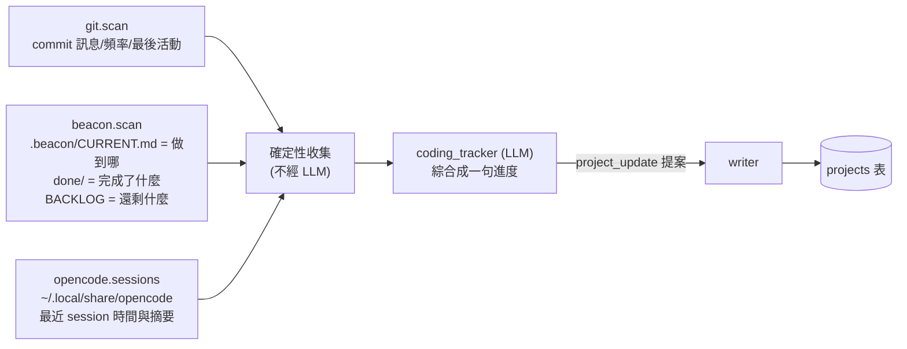
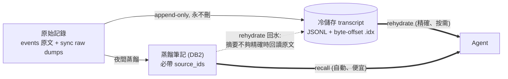
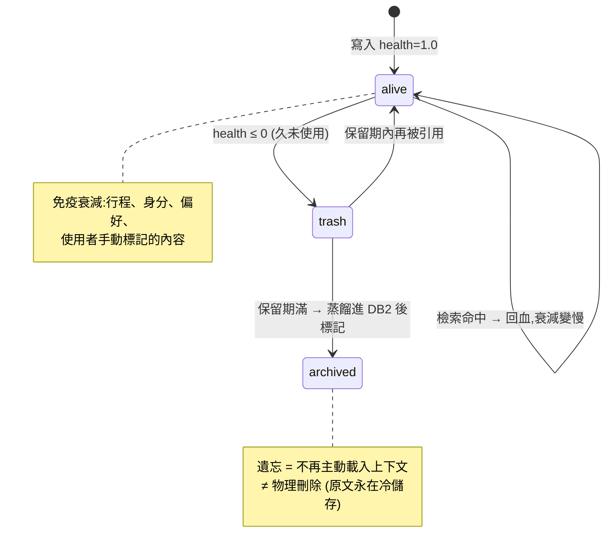
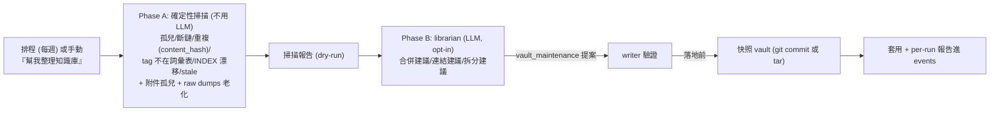
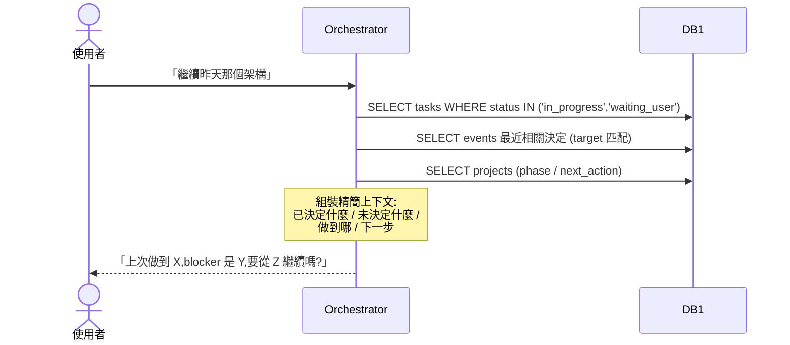
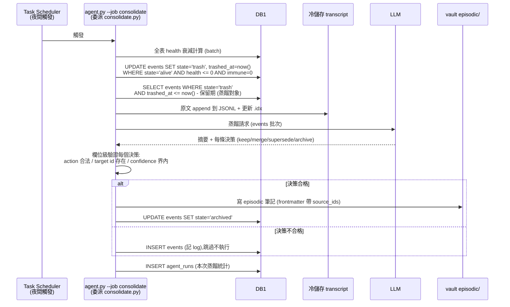
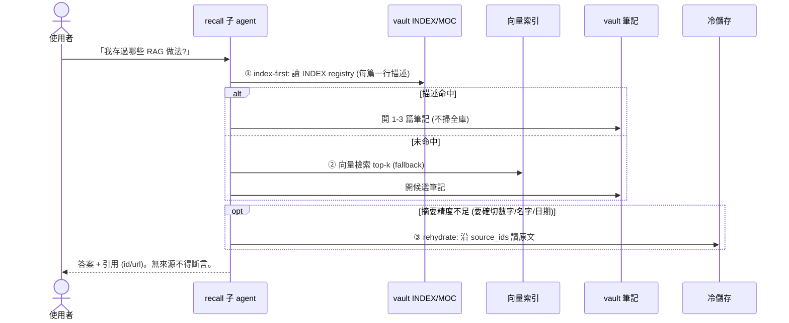
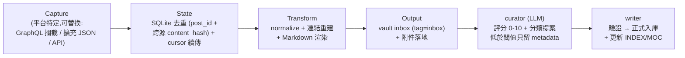
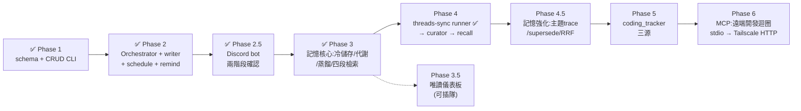

# MY AGENT — 個人行程 + 知識庫助理 架構文件

> **專案代號:Metatron**(天界書記官)——orchestrator 的角色定位。子 agent 從
> Metatron 麾下天使名選取(Sandalphon/Raziel/Zerachiel/Jophiel/Uriel/Anael)。
> 完整命名映射與封存清單見 [AGENTS.md](AGENTS.md) §Angel naming registry。
> 天使名為顯示層命名,程式碼識別符(role_type / 模組 / --job)維持技術名以保 API 穩定。
>
> 狀態:設計定案,實作依 `.beacon/` 推進。前身參考:[threads-sync](https://github.com/Deo940712/threads-sync)
> (Capture → State → Transform → Output 管線、config.py 集中路徑、SQLite 去重、每步 idempotent)。
> 時間欄位:DB1 與冷儲存一律 **UTC epoch 秒 (INTEGER)**;vault frontmatter 是人類介面,用可讀字串(`YYYY-MM-DD HH:mm`)。
> `DATA_DIR = C:\Users\tcart\my-agent-data`(本地、OneDrive 外;後期遷 VPS 只改 config.py)。

## 1. 目標

一個處理「我的很多事情」的大型個人助理,但**不能肥大難維護**:

- 行程 / 待辦 / 提醒管理
- 知識庫:X、Threads、FB 的內容整理進 Obsidian
- vibe coding 專案進度追蹤
- **拋棄上下文**:無長 session,agent 每次呼叫皆無狀態

## 2. 總體架構圖

```mermaid
flowchart TD
    U[使用者] -->|"CLI / Discord / 儀表板 / MCP<br/>(介面層詳見 INTERFACES.md)"| O

    subgraph CORE["core/ (無狀態,一次呼叫即結束)"]
        O["agent.py<br/>Orchestrator:讀狀態→派工→綜合→寫回→死"]
        W["writer.py<br/>單一寫入口:驗證提案後落地"]
        CB["Context Builder<br/>組裝本次執行的最小上下文"]
    end

    subgraph AGENTS["agents/ (子 agent:只提案,不寫 DB)"]
        A1[schedule]
        A2[curator]
        A3[coding_tracker]
        A4[recall]
        A5[librarian]
    end

    subgraph SKILLS["skills/ (非 LLM,純 CLI 管線)"]
        S1[threads_sync]
        S2[x_sync]
        S3[fb_sync]
    end

    subgraph STORAGE["儲存層"]
        DB1[("DB1 state.db<br/>SQLite = System of Record<br/>八張表")]
        DB2[("DB2 Obsidian vault<br/>Markdown 知識介面<br/>semantic/ + episodic/ + agent/")]
        COLD[("冷儲存 transcript<br/>append-only JSONL + .idx<br/>永不刪")]
        VEC[("向量索引<br/>衍生物,可重建")]
    end

    O --> CB
    CB --> DB1
    O -->|scoped 任務| A1 & A2 & A3 & A4 & A5
    A1 & A2 & A3 & A5 -->|結構化提案| W
    W -->|驗證通過| DB1
    W -->|驗證通過| DB2
    O -->|排程觸發| S1 & S2 & S3
    S1 & S2 & S3 -->|.md 進 inbox| DB2
    S1 & S2 & S3 -->|cursor/去重| DB1

    CON["consolidate.py<br/>夜間蒸餾 job"] --> DB1
    CON -->|原文落地| COLD
    CON -->|蒸餾筆記 (帶 source_ids)| DB2
    A4 -.->|index-first 讀| DB2
    A4 -.->|fallback| VEC
    A4 -.->|rehydrate 回水| COLD
    DB2 -->|重建| VEC
```

角色定位(重新定義過的「雙資料庫」):

| 儲存 | 角色 | 備份需求 |
|---|---|---|
| DB1 `state.db` | **System of Record**:結構化事實唯一來源(狀態、行程、事件、游標) | 每日備份 |
| DB2 vault | **人類知識介面**:你在 Obsidian 讀寫連結的 markdown | git 版控 |
| 冷儲存 transcript | **原始記錄層**:蒸餾前的原文,append-only 永不刪 | 隨 DATA_DIR 備份 |
| 向量索引 | **衍生物**:壞了刪掉重建,不存唯一資料 | 不備份 |

## 3. 多 Agent 拓撲(Orchestrator + 無狀態子 Agent)

2026 三大框架(LangGraph supervisor、Claude Agent SDK subagents、OpenAI Agents SDK triage)收斂的生產標準:**一個 agent 持有全局視野,子 agent 做 scoped 工作後回傳結構化摘要即消失**。

子 agent 契約(Clean Summary Discipline):

- **輸入最小化**:只給任務描述 + 必要 ID/路徑,不給 orchestrator 完整歷史
- **輸出契約寫死**:每個子 agent 定義回傳格式(欄位、上限長度、禁止項如原文全文)
- **平行規則**:互相獨立才平行(sync 各平台可平行);有依賴就串行(curator 要等 sync)
- **模型分級**:bounded 任務(分類、抽取、格式化)用便宜模型;綜合與決策用強模型
- **單層**:子 agent 不再生子 agent
- **寫入鐵律**:子 agent 只提案,writer.py 驗證後落地

| 子 Agent | 職責 | 輸入 | 輸出契約 | 狀態 |
|---|---|---|---|---|
| schedule | 行程/待辦/提醒解析(rrule 重複、remind 預設 30 分) | 使用者原句 + 現有項目 | `schedule_change`/`task_change` 提案 | ✅ |
| consolidator | 夜間蒸餾:到期 events → episodic 日誌 / preference 偏好;五條欄位級驗證 | 到期 events 批次(按天分組) | 蒸餾組(kind/title/summary/tags/source_ids/confidence) | ✅ |
| curator | 貼文評分(0-10 閘門)、分類、去重、入 vault、建連結 | inbox 筆記路徑批次 | `classify_note` 提案 | 📋 part-004 |
| librarian | vault 圖書管理員:孤兒/斷鏈/重複/tag 蔓延/INDEX 漂移/stale 維護(§4.3) | 維護掃描器的確定性報告 | `vault_maintenance` 提案(dry-run 先行) | 📋 part-004+ |
| coding_tracker | 三源進度綜合(git + beacon + opencode) | 專案路徑清單 | `project_update` 提案 | 📋 part-005 |
| sync-{threads,x,fb} | 平台抓取管線(非 LLM,純 CLI;threads 經 skills/runner) | cursor | new_count, status | threads ✅ / x,fb 📋 |
| recall | 四段級聯檢索答問(index→FTS→向量→rehydrate) | 查詢字串 | 引用來源的答案(≤500 字) | 📋 part-004 |

### 3.1 提案(Proposal)格式

所有子 agent → writer 的統一信封(JSON):

```jsonc
{
  "agent": "curator",              // string: 提案者
  "proposal_type": "classify_note",// string: 見下表
  "target": "inbox/20260712-xxx.md", // string: 目標 (DB1 rowid 或 vault 路徑)
  "payload": { /* 依 proposal_type 而異 */ },
  "confidence": 0.87,              // float 0.0-1.0
  "evidence": ["原文中的依據段落"]  // string[]: 必須真實存在於來源
}
```

| proposal_type | 提案者 | payload 欄位 |
|---|---|---|
| `schedule_change` | schedule | `{action: "add"\|"update"\|"done"\|"cancel", fields: {...}}` |
| `task_change` | schedule | 同上 |
| `classify_note` | curator | `{score: float, tags: string[], summary: string, links: string[]}` |
| `project_update` | coding_tracker | `{phase: string, blockers: string[], next_action: string}` |
| `agent_note` | orchestrator(僅限使用者顯式指示,如「存成 SOP」) | `{subdir: "profile"\|"ops"\|"sop", title: string, body: string, tags: string[]}` |
| `vault_maintenance` | librarian | `{op: "merge"\|"link"\|"retag"\|"split"\|"archive_stale"\|"fix_index", targets: string[], detail: {...}}` |

writer.py 驗證規則(全部通過才落地):

1. `target` 存在(DB1 rowid 或 vault 檔案)
2. `tags` 全部在受控詞彙表內(INDEX.md 定義)
3. `evidence` 每條可在來源原文中找到(字串比對)
4. 不覆蓋人工修改過的欄位(threads-sync 規則:手動 tag 永不覆蓋)
5. `action`/enum 值合法、`confidence` 在 [0,1]
6. 拒絕時記 log(events 表),不執行、不重試
7. **`schedule_change`/`task_change` 的寫入類 action(add/update/cancel)額外需要
   使用者確認**:writer 先回傳預覽,confirm 後才落地(§6.6 分工鐵律);
   done 與查詢不需確認

### 3.2 工具層(Tool Registry)

子 agent 分兩型,決定要不要給工具:

| 型 | 子 agent | 工具 | 理由 |
|---|---|---|---|
| **純函數型**(輸入→提案,單次 LLM 呼叫) | schedule, curator, librarian, coding_tracker | **無工具**。orchestrator/skill 先確定性地收集好輸入 | 可測試、可重放、便宜 |
| **代理型**(需要迭代檢索) | recall | 唯讀工具白名單(見下) | 檢索本質是多步的 |

工具清單(Python 函式,core 持有;recall 只拿唯讀子集):

| 工具 | 簽名(簡) | 讀/寫 | 誰用 |
|---|---|---|---|
| `index.search` | `(query) -> [{id, path, summary}]` | 讀 | recall |
| `note.read` | `(id) -> {frontmatter, body}` | 讀 | recall |
| `vector.search` | `(query, k) -> [{note_id, score}]` | 讀 | recall(fallback) |
| `transcript.rehydrate` | `(entry_ids \| time_window \| keyword) -> [原文]` | 讀 | recall |
| `stm.query` | `(domain, filter) -> rows` | 讀 | orchestrator 組上下文 |
| `writer.apply` | `(proposal) -> ok\|rejected` | **寫(唯一)** | 只有 orchestrator |
| `notify.send` | `(message, channel) -> ok` | 外部 | 只有 remind job |
| `git.scan` | `(repo_path) -> {last_commit_at, recent_commits[]}` | 讀 | coding_tracker 輸入收集 |
| `beacon.scan` | `(repo_path) -> {current_slice, status, done[], backlog_count}` | 讀 | coding_tracker 輸入收集 |
| `opencode.sessions` | `(project_path) -> [{session_id, last_at, summary}]` | 讀 | coding_tracker 輸入收集 |
| `vault.scan` | `() -> {orphans[], broken_links[], dupes[], bad_tags[], index_drift[], stale[], orphan_attachments[], raw_dump_aging[]}` | 讀 | librarian Phase A(確定性掃描;含 data/ 附屬掃描) |

硬規則:**寫入面只有 `writer.apply` 一個**;其餘全部唯讀。子 agent 的工具白名單寫死在 `agents/*.md`。

**危險操作閘門**(借鑑 Hermes 的 approval 分層,適配本專案規模):

| 層 | 內容 |
|---|---|
| 硬底線(永不執行,無開關) | 物理刪除 vault 筆記/冷儲存/DB1 整表;繞過 writer 直寫;覆蓋 `manual_tags: true` |
| 需確認(預覽 + ✅) | 行程/待辦寫入(§3.1 規則 7)、librarian 批次維護落地、supersede 既有筆記 |
| 自動放行 | 唯讀查詢、done 標記、events append、sync 管線 inbox 寫入(本來就進緩衝區) |
| 逾時 = 拒絕 | 確認等待逾時一律 fail-closed(同 Hermes approval timeout) |

### 3.3 coding_tracker 的三個進度訊號源

vibe coding 進度不靠 LLM 猜,從三個確定性來源讀(全部唯讀):



- `.beacon/` 是最高品質訊號:你的專案都用 Beacon 工作流,`CURRENT.md` 的
  Part/Slice/Status 直接 parse 即得精確進度,不用推測
- OpenCode session 儲存為本機 JSON(`C:\Users\tcart\.local\share\opencode`),
  讀最後 session 時間 = 最近在哪個專案工作。只讀,永不寫
- `projects.repo_path`(§5.1)是三個掃描器的共同輸入

### 3.4 介面層(前端/後端)

介面層有獨立設計文件:**[INTERFACES.md](INTERFACES.md)**(設計權威)。摘要:

| 介面 | 場景 | 讀/寫 | 時程 |
|---|---|---|---|
| CLI | 開發、排程 job | 讀+寫 | Phase 1-2 |
| Obsidian | 知識庫閱讀/編輯 | 讀+寫(vault) | 零成本 |
| Discord bot(私人 server,鎖 user ID) | 出門:提醒推播 + 排事情 | 讀+寫(走 writer+確認) | Phase 2.5 |
| 網頁儀表板(FastAPI+htmx,127.0.0.1) | 在家:總覽 + 系統健康 | **唯讀**(`mode=ro`) | Phase 3.5 |
| MCP server | OpenCode 內查詢 | 唯讀優先 | Phase 6 |

鐵律:channel = 薄 adapter 零業務邏輯;共用 `invoke(text, trigger, reply_to)`;
寫入不因來源開後門;**提醒通知管道 = Discord DM(開放決策已解)**。

### 3.5 MCP 規劃

| 方向 | 決定 | 說明 |
|---|---|---|
| **對外暴露(server)** | Phase 6(backlog) | 把 `recall_query` / `schedule_list` / `project_status` 包成 MCP server(借鑑 Horizon 的 MCP 模式)。屆時你在 OpenCode / Claude Code 任何 session 裡都能直接問自己的助理(「我存過哪些 RAG 貼文?」「今天行程?」),不用切視窗 |
| **對內消費(client)** | 不做 | skills 是純 CLI 管線,不需要 MCP client;避免多一層依賴 |
| **Claude skills** | 不衝突 | `agents/*.md` 是本專案自己的 prompt 契約;若之後想讓 Claude Code 直接操作 vault,可另寫 SKILL.md(參考 DesktopCommanderMCP 的 knowledge-base skill),與本系統互不干擾 |

MCP server **一套工具、兩種傳輸**(part-006 定案):`core/mcp/tools.py` 工具定義
與傳輸分離,共用兩個薄 adapter——
- **slice-1 本機 stdio**:OpenCode 直接 spawn Python 進程,零網路(現可做)
- **slice-2 遠程 HTTP/SSE**:VPS 常駐,綁 **Tailscale IP**(WireGuard 私有網路,
  不上公網 → 零認證複雜度、零攻擊面;綁公網 IP 啟動即拒絕,fail-closed)

讀寫皆可:查詢類免確認;寫入類(`schedule_add`)復用 chat.py 兩階段——回 pending +
預覽,使用者在任一介面確認(pending 是 DB1 共用,跨介面天然一致)。**寫入不因
來源是 MCP 而繞過 writer + 確認。** 遠程走 Tailscale 私有網路後,recall 全文的
內容分級(§4.1)解除。

## 4. 記憶模型:四層 × 三時間尺度

記憶按**性質**分四層(語義按受眾、程序按來源各再分二),按**生命週期**用三時間尺度管理
(借鑑 [memory-river](https://github.com/Hsi431/memory-river))。
**Session(對話逐字稿)不是記憶,預設不保存。**

| 層 | 回答的問題 | 存哪 | 生命週期 |
|---|---|---|---|
| Working State | 「做到哪了?」 | DB1(tasks.status, cursors, projects) | 任務完結即封存 |
| Episodic 情節 | 「發生過什麼?」 | DB1 `events`(短期緩衝)→ 蒸餾進 DB2 `episodic/` | 健康值代謝 |
| Semantic 語義(給你) | 「我知道什麼?」 | DB2 `semantic/`(社交貼文知識、學習筆記) | 持久;supersede 鏈修正 |
| **Semantic 語義(給 agent)** | 「關於使用者/系統,agent 該知道什麼?」 | DB2 **`agent/`**(偏好、事實、營運教訓、學到的 SOP)——見 §4.2 | 持久;supersede 鏈修正 |
| Procedural 程序(固定) | 「怎麼做?」(寫死的) | `agents/*.md` + `skills/` 程式碼本身 | git 版控 |
| Procedural 程序(學到的) | 「怎麼做?」(執行中學到的) | DB2 `agent/sop/`(顯式保存,漸進揭露) | 持久;可 supersede |

三時間尺度與回水:



**核心原則:壓縮永不等於丟失**——每條蒸餾記憶留有回溯路徑,摘要錯了可重蒸餾。

### 4.1 健康值代謝(取代硬 TTL)



可物理刪除的只有:暫存檔、重複內容、過期 CDN URL、raw debug dumps。
衰減公式與參數(衰減率、回血量、trash 保留天數)為 part-003 可調項,不在此定死。

### 4.2 Agent 知識庫(`vault/agent/`)

vault 分兩個知識受眾:`semantic/` + `episodic/` 給**你**讀;**`agent/` 給 agent 自己用**
——orchestrator 組上下文、子 agent 執行時參照的知識儲備。三類:

| 子目錄 | 內容 | 例子 | 誰寫入 |
|---|---|---|---|
| `agent/profile/` | 使用者偏好與穩定事實 | 「偏好 Python+uv」「工作日 9-18 不排私人行程」「回覆用繁中」 | consolidation 從 events 蒸餾出偏好類事實;或你手動寫 |
| `agent/ops/` | 營運教訓(平台踩坑、系統經驗) | 「Threads /api/graphql 會回 anti-scripting,要用 /graphql/query」「X query ID 每 2-4 週輪換」 | 你手動寫;或 consolidation 從 failed events 蒸餾 |
| `agent/sop/` | 學到的流程(程序記憶的可成長部分) | 「inbox 清理順序:先跨源去重再分類」 | **只顯式保存**(你說「把這個存成 SOP」),agent 永不自動生成(memory-river skill capsule 規則) |

規則:

- **frontmatter 與 semantic 筆記同 schema**(§5.2;`source: agent_knowledge`),同樣受
  穩定 ID、受控 tag、supersede 鏈、INDEX registry 管理——不是新機制,是同機制的新受眾
- **免疫衰減**:agent/ 全部免疫(等同 memory-river 的 identity/constraint 類)
- **載入方式 = 漸進揭露**(借鑑 memory-river skill capsule + DesktopCommander index-first):
  orchestrator 每次呼叫只注入 `agent/` 的 **INDEX 一行描述清單**(幾百 token);
  子 agent 按需開檔。**絕不整包塞 prompt**——那是肥大的回頭路
- **寫入走同一條路**:consolidation 蒸餾或 writer 落地,LLM 決策同樣過欄位級驗證;
  你手動編輯永遠優先(manual_tags 規則)
- 對 recall 可見:你問「我的偏好是什麼」也查得到——agent/ 不是黑盒

### 4.3 Librarian(vault 圖書管理員)

知識庫會髒:孤兒筆記、斷鏈、近重複、tag 蔓延、INDEX 與實際檔案漂移、過時內容。
librarian 是**維護 vault 的子 agent**,綜合三個借鑑:

- **DesktopCommander knowledge-base skill 的維護 SOP**:孤兒偵測(無入鏈)、斷鏈驗證
  (registry 路徑逐一 `get_file_info`,不能只靠文字比對)、非原子筆記拆分、重複合併、tag 蔓延對照受控詞彙表
- **Hermes Curator 的節律與安全網**(hermes-agent.nousresearch.com/docs/features/curator):
  低頻觸發(週期 + 閒置雙條件)、**兩階段**(確定性轉換不用 LLM;LLM 整理 opt-in)、
  **執行前快照可整包回滾**、pinned 豁免、per-run 報告可稽核
- **memory-river 夜間鞏固**:LLM 每個決策欄位級驗證後才執行

運作設計:

管轄範圍:vault 全域(semantic/ + episodic/ + agent/)**加上 data/ 附屬掃描**
(attachments 孤兒 = 沒被任何筆記引用的圖片;raw dumps 老化報告)。
vault 外的本機檔案(下載/桌面)**不管**——那是檔案管家,超出知識庫範圍。



規則(照抄 Hermes Curator 的保守哲學):

| 規則 | 內容 |
|---|---|
| 兩階段 | Phase A 純程式掃描,零 LLM 成本,隨時可跑;Phase B LLM 整理**預設關**,顯式開 |
| 永不刪除 | 最壞結果是移入 `vault/.archive/`(可還原);物理刪除永遠不做 |
| 快照先行 | 每次落地前 git commit(vault 已版控)——整趟可回滾 |
| pinned 豁免 | `manual_tags: true` 或使用者 pin 的筆記,librarian 碰不得 |
| dry-run 先行 | 預設只出報告;你看過才 apply(等同 `hermes curator run --dry-run`) |
| 報告可稽核 | 每趟寫 events + 報告檔:動了哪些筆記、合併對照表(rename map) |
| agent/sop/ 特別保守 | 只報告 stale,不主動合併(SOP 是使用者顯式存的) |
| 附件孤兒 | 只報告 + 建議移入 `.archive/`;圖片永不物理刪除(它們是原始記錄的一部分) |
| raw dumps 老化 | 只出報告(哪些 dump 超過 N 天、佔多少空間);清理由你手動決定——這是§4.1 唯一可物理刪除類別,但仍不自動刪 |

## 5. 資料模型

### 5.1 DB1 `state.db` 完整 DDL(八張表)

```sql
-- 行程 (免疫衰減)
CREATE TABLE schedule (
  id           INTEGER PRIMARY KEY AUTOINCREMENT,
  title        TEXT    NOT NULL,
  detail       TEXT,
  start_at     INTEGER NOT NULL,             -- UTC epoch 秒
  end_at       INTEGER,                      -- NULL = 無結束時間
  remind_at    INTEGER,                      -- NULL = 不提醒
  reminded_at  INTEGER,                      -- 已發提醒的時間,NULL = 未發 (防重複提醒)
  rrule        TEXT,                         -- NULL = 單次;重複行程存 RRULE 字串 (RFC 5545 子集,
                                             --   如 'FREQ=WEEKLY;BYDAY=MO')。remind job 發完提醒後
                                             --   由確定性程式計算下次 start_at/remind_at 並 UPDATE 同列
  status       TEXT    NOT NULL DEFAULT 'active'
               CHECK (status IN ('active','done','cancelled')),
  created_at   INTEGER NOT NULL
);
CREATE INDEX idx_schedule_remind ON schedule(remind_at)
  WHERE status = 'active' AND reminded_at IS NULL;

-- 待辦 (Working State)
CREATE TABLE tasks (
  id          INTEGER PRIMARY KEY AUTOINCREMENT,
  title       TEXT    NOT NULL,
  detail      TEXT,
  due_at      INTEGER,
  status      TEXT    NOT NULL DEFAULT 'pending'
              CHECK (status IN ('pending','in_progress','waiting_user','done','archived')),
  created_at  INTEGER NOT NULL
);
CREATE INDEX idx_tasks_status ON tasks(status);

-- vibe coding 專案進度 (Working State)
CREATE TABLE projects (
  id           INTEGER PRIMARY KEY AUTOINCREMENT,
  name         TEXT    NOT NULL UNIQUE,
  repo_path    TEXT,                         -- 本機 repo 路徑 (coding_tracker 掃 git log 用)
  phase        TEXT,                         -- 自由文字,如 'phase-2' / 'MVP'
  blockers     TEXT,                         -- JSON array 字串: '["等 API key","schema 未定"]'
  next_action  TEXT,
  updated_at   INTEGER NOT NULL,
  created_at   INTEGER NOT NULL
);

-- skill 管線游標/去重狀態 (threads-sync store.py 模式)
CREATE TABLE cursors (
  pipeline    TEXT NOT NULL,                 -- 'threads_sync' | 'x_sync' | ...
  key         TEXT NOT NULL,                 -- 'end_cursor' | 'last_post_id' | ...
  value       TEXT,
  updated_at  INTEGER NOT NULL,
  PRIMARY KEY (pipeline, key)
);

-- 每次 agent 呼叫的執行記錄 (斷點/靜默壞掉偵測)
CREATE TABLE agent_runs (
  id           INTEGER PRIMARY KEY AUTOINCREMENT,
  started_at   INTEGER NOT NULL,
  finished_at  INTEGER,                      -- NULL = 執行中或異常終止
  trigger      TEXT NOT NULL CHECK (trigger IN ('cli','scheduler','chat')),
  status       TEXT NOT NULL DEFAULT 'running'
               CHECK (status IN ('running','ok','error','login_expired','partial')),
  summary      TEXT,                         -- 本次做了什麼 (一句話)
  error        TEXT                          -- 失敗原因
);

-- 情節記憶短期緩衝 (Episodic)
CREATE TABLE events (
  id                INTEGER PRIMARY KEY AUTOINCREMENT,
  ts                INTEGER NOT NULL,        -- 事件發生時間
  actor             TEXT    NOT NULL,        -- 'user'|'orchestrator'|'curator'|'schedule'|...
  action            TEXT    NOT NULL,        -- 'decision'|'completed'|'failed'|'state_change'|'proposal_rejected'
  target            TEXT,                    -- 影響對象 (task id / vault 路徑 / 專案名)
  summary           TEXT    NOT NULL,        -- 一句話描述 (蒸餾的輸入)
  source_ids        TEXT,                    -- JSON array: 冷儲存 entry_id ['evt:123', ...] (回水指標)
  health            REAL    NOT NULL DEFAULT 1.0,   -- 0.0-1.0 代謝健康值
  last_accessed_at  INTEGER,                 -- 最後被檢索命中時間 (回血依據)
  immune            INTEGER NOT NULL DEFAULT 0,     -- 1 = 免疫衰減 (使用者手動標記/身分/偏好類)
  state             TEXT    NOT NULL DEFAULT 'alive'
                    CHECK (state IN ('alive','trash','archived')),
  trashed_at        INTEGER,                 -- 進 trash 的時間 (保留期判斷依據),NULL = 不在 trash
  created_at        INTEGER NOT NULL
);
CREATE INDEX idx_events_ts ON events(ts);
CREATE INDEX idx_events_state_health ON events(state, health);

-- 待確認提案 (part-002.5:非同步兩階段確認;bot/MCP 重啟不丟)
CREATE TABLE pending_proposals (
  id           INTEGER PRIMARY KEY AUTOINCREMENT,
  proposal     TEXT    NOT NULL,          -- JSON 序列化的提案信封
  preview      TEXT    NOT NULL,          -- 已算好的預覽文
  status       TEXT    NOT NULL DEFAULT 'pending'
               CHECK (status IN ('pending','done','cancelled','expired')),
  channel_ref  TEXT,                      -- 回覆定址 (Discord user id / MCP client)
  created_at   INTEGER NOT NULL
);
CREATE INDEX idx_pending_status ON pending_proposals(status);

-- 遠端指令佇列 (part-006 slice-1 實作;目前 stm 為七表,此表隨 part-006 加入)
CREATE TABLE directives (
  id           INTEGER PRIMARY KEY AUTOINCREMENT,
  project      TEXT    NOT NULL,          -- 目標專案 (對應 projects.name 或路徑)
  text         TEXT    NOT NULL,          -- 指令內容
  status       TEXT    NOT NULL DEFAULT 'pending'
               CHECK (status IN ('pending','consumed','cancelled')),
  created_at   INTEGER NOT NULL,
  consumed_at  INTEGER                    -- 被 session 讀取執行的時間
);
CREATE INDEX idx_directives_status ON directives(status, project);
```

**記錄原則**(events 只記,防止變成另一種肥大 session):
使用者決定、agent 完成的重要工作、失敗/阻塞/恢復、專案狀態重大改變、對未來任務有影響的事件。
**不記**:閒聊、中間推理、每次工具呼叫、可從 DB 狀態重新推導的細節。

### 5.2 DB2 vault 筆記 frontmatter schema

vault 結構(借鑑 DesktopCommanderMCP knowledge-base skill 的 index-first 規範):

```
vault/
├── INDEX.md            # 入口:操作規則 + 受控 tag 詞彙表 + registry (每篇一行,含 agent/)
├── semantic/           # 給你:貼文知識、學習筆記 (含既有 threads-sync 輸出遷入)
├── episodic/           # 給你:consolidation 產出的日誌式摘要
├── agent/              # 給 agent:知識儲備 (§4.2;全部免疫衰減)
│   ├── profile/        #   使用者偏好與穩定事實
│   ├── ops/            #   營運教訓 (平台踩坑、系統經驗)
│   └── sop/            #   學到的流程 (只顯式保存)
├── _index/             # 分類 MOC (threads-sync 已有)
└── attachments/        # 圖片落地
```

**semantic 筆記**(社交貼文,threads-sync 格式擴充):

| 欄位 | 型態 | 必填 | 說明 |
|---|---|---|---|
| `id` | string | ✅ | `YYYYMMDD-slug`,穩定永不改、不重用 |
| `source` | enum | ✅ | `threads` \| `x` \| `fb` \| `manual` \| `agent_knowledge`(§4.2) |
| `source_id` | string | ✅ | 平台 post_id(去重主鍵) |
| `url` | string | ✅ | 原文連結(溯源硬規則) |
| `author` | string | ✅ | 作者帳號 |
| `date` | string | ✅ | 原文發布時間 `YYYY-MM-DD HH:mm` |
| `captured_at` | string | ✅ | 抓取時間 |
| `likes` | int | | 按讚數(MOC 排序用) |
| `score` | float | | curator 評分 0.0-10.0,低於閾值只留 metadata |
| `tags` | string[] | ✅ | 只能用 INDEX.md 受控詞彙表;新筆記先 `inbox` |
| `content_hash` | string | | 內文 SHA-256 前 16 碼(跨源同文合併用) |
| `manual_tags` | bool | | `true` = 人工改過,writer 永不覆蓋 |

`source: agent_knowledge` 時:`url`/`author`/`source_id`/`likes` 不適用(免填);
溯源改由 `source_ids`(指向蒸餾來源 events)或 `manual: true`(你手寫)承擔——
無來源標記的 agent 知識不得存在。

**episodic 筆記**(consolidation 產出):

| 欄位 | 型態 | 必填 | 說明 |
|---|---|---|---|
| `id` | string | ✅ | `YYYYMMDD-slug` |
| `source` | enum | ✅ | 固定 `consolidation` |
| `period` | string | ✅ | 涵蓋期間 `2026-07-05..2026-07-12` |
| `source_ids` | string[] | ✅ | 回水指標,指向冷儲存 entry_id |
| `distilled_at` | string | ✅ | 蒸餾時間 |
| `model` | string | ✅ | 蒸餾用的 LLM(重蒸餾時判斷版本) |
| `tags` | string[] | ✅ | 受控詞彙表 |

**修正筆記**(supersede,兩類皆可):加 `supersedes: <舊筆記 id>`;舊筆記由 writer 補
`superseded_by: <新筆記 id>`。舊筆記不刪。結構化參數(如「SSH port 2222」)在
payload 中以 slot 形式記錄:`slots: {ssh_port: "2222"}`,recall 只回最新 active 值。

### 5.3 冷儲存 transcript(append-only JSONL)

```
data/transcript/
├── 2026-07.jsonl       # 按月輪替
└── 2026-07.jsonl.idx   # byte-offset 索引,O(1) 尋址
```

每行一筆:

```jsonc
{
  "entry_id": "evt:123",          // string: '<namespace>:<local-id>',全域唯一
                                  //   evt:<events.id> | raw:<pipeline>:<post_id>
  "ts": 1752300000,               // int: UTC epoch 秒
  "kind": "event_raw",            // enum: 'event_raw' | 'sync_raw' | 'llm_io'
  "payload": { /* 原文,結構依 kind */ }
}
```

`.idx` 每行:`entry_id<TAB>byte_offset<TAB>length`。寫入只 append;輪替按月;永不刪。

### 5.4 向量索引(衍生物)

```sql
-- 獨立檔 index.db (與 state.db 分離,可整檔刪除重建)
CREATE TABLE embeddings (
  note_id     TEXT PRIMARY KEY,   -- vault 筆記 id 或 'evt:<id>'
  vector      BLOB NOT NULL,      -- float32[dim] (sqlite-vec 格式,選型見開放決策)
  model       TEXT NOT NULL,      -- embedding 模型名
  model_ver   TEXT NOT NULL,      -- 換模型 = 全量重建
  indexed_at  INTEGER NOT NULL
);
```

規則:每筆必指回 note_id/entry_id;不存唯一資料;換 embedding 模型時整表重建並跑 golden queries 回歸。

## 6. 關鍵流程

### 6.1 使用者指令流(一次呼叫的完整生命週期)

```mermaid
sequenceDiagram
    actor U as 使用者
    participant O as agent.py<br/>(Orchestrator)
    participant S as stm.py (DB1)
    participant A as 子 agent
    participant W as writer.py

    U->>O: 指令 (CLI / chat)
    O->>S: INSERT agent_runs (status=running)
    O->>S: 讀 Working State + 相關 events (Context Builder)
    O->>O: 載入 vault agent/ 的 INDEX 一行描述<br/>(漸進揭露,§4.2;不整包塞)
    O->>A: 派工 (最小輸入: 任務描述 + 必要 ID<br/>+ 相關 agent/ 筆記路徑)
    A-->>O: 結構化提案 + 摘要 (中間過程丟棄)
    O->>W: 提交提案
    W->>W: 驗證: target 存在 / tags 合法 /<br/>evidence 屬實 / 不覆蓋人工修改
    alt 驗證通過
        W->>S: 落地寫入 + INSERT events (記錄變更)
    else 驗證失敗
        W->>S: INSERT events (action=proposal_rejected)
        W-->>O: 拒絕 + 原因
    end
    O->>S: UPDATE agent_runs (status=ok, summary)
    O-->>U: 結果摘要
    Note over O: 行程結束。無 session 殘留,<br/>下次呼叫從 DB1 重建上下文
```

### 6.2 「繼續昨天的工作」——無 session 的接續



### 6.3 夜間 consolidation(蒸餾)



### 6.4 recall 三段式檢索



### 6.5 sync 管線(每個平台 skill 同構)



每步 idempotent、中斷重跑續傳(threads-sync 已驗證)。分類配額防單一主題洪水(借鑑 Horizon category_groups)。

### 6.6 提醒觸發(確定性,不經 LLM)

```mermaid
sequenceDiagram
    participant T as Task Scheduler<br/>(每 N 分鐘)
    participant J as agent.py --job remind
    participant S as DB1

    T->>J: 觸發
    J->>S: SELECT * FROM schedule<br/>WHERE remind_at <= now()<br/>AND status='active' AND reminded_at IS NULL
    S-->>J: 到期清單
    loop 每筆
        J->>J: 發送通知 (Discord DM;開發期 console)
        alt rrule IS NULL (單次)
            J->>S: UPDATE schedule SET reminded_at = now()
        else 重複行程
            J->>S: UPDATE 同列: start_at/remind_at 前推到下次發生<br/>(rrule 確定性展開), reminded_at 清回 NULL
        end
    end
    J->>S: INSERT agent_runs
```

分工鐵律:**LLM 只做**自然語言解析成候選行程、衝突解釋;**確定性程式做**時區轉換、
重複展開、提醒觸發、到期判斷、寫入。任何行程新增/修改/刪除先回傳預覽,使用者確認才落地;查詢不需批准。

## 7. 貼文來源與抓取策略(2026 現況)

| 平台 | 官方管道 | 實際可行做法 | 決定 |
|---|---|---|---|
| Threads 已儲存 | 無 API | threads-sync 已解:真實 session + Playwright GraphQL 攔截 | ✅ 沿用 |
| X 書籤 | API 付費且實測 ~800 則封頂;官方 archive 不含書籤 | ① 複製 threads-sync 模式打 x.com 內部 GraphQL(query ID 每 2-4 週輪換,需 probe 工具)② 開源 [xarchive](https://github.com/sytelus/xarchive) Chrome 擴充→JSON→轉換器入 vault | ② 起步(快),要自動化再做 ① |
| FB 珍藏 | 無 API | Meta 反爬最強;同 threads-sync 模式但風險高 | 最後做,先 probe 評估 |
| 未來擴充 | — | 任何能出 JSON/CSV 的來源(Readwise、RSS)走同一管線 | 介面統一:JSON in → .md out |

## 8. 記憶可靠性保障

| 風險 | 機制 |
|---|---|
| 記憶錯誤/幻覺 | **溯源硬規則**:每篇筆記必帶 source URL + 抓取時間 + `source_ids`;recall 回答必附引用,無來源不得斷言;精度不足沿 source_ids 回讀原文 |
| 重複記憶 | sync 用 post_id + 跨源 content_hash;consolidation 用 Mem0 式「抽取→比對→ADD/UPDATE/SKIP」三態決策 |
| 記憶遺失 | 原始記錄 append-only 永不刪;DB2 純文字 git 可版控;DB1 每日備份;管線 idempotent |
| 過期事實 | 新事實 supersede 舊事實留 `superseded_by` 鏈,不刪;結構化參數走 slot 版本鏈,檢索只回最新值 |
| 靜默壞掉 | `agent_runs` 記錄每次執行 status;sync 管線繼承 threads-sync 的 `sync_runs` 偵測 |
| 檢索品質退化 | **golden queries 回歸測試**:20-30 條「這樣問應該找到那篇」,改索引/embedding 必跑 |
| 寫入污染長期庫 | 單向流 + inbox 緩衝 + 評分閘門 + 分類配額;手動改過的 tag 永不覆蓋 |
| LLM 決策污染 | consolidation 每個 LLM 決策過欄位級驗證,不合格跳過並記 log,永不直接執行 |
| 子 agent 亂寫 | **Agent 提議、程式驗證、單一 writer 落地**(§3.1) |

## 9. 目錄結構

狀態標記:✅ 已實作|📋 規劃中

```
my-agent/
├── core/                    # 無狀態核心
│   ├── agent.py          ✅ # 入口:invoke 全流程;--job remind/consolidate/curate/track
│   ├── stm.py            ✅ # DB1 存取層(八張表,§5.1)+ CLI
│   ├── llm.py            ✅ # OpenAI 相容薄層(重試/JSON 模式/降級/events 記錄)
│   ├── subagents.py      ✅ # 子 agent 執行器(讀契約→組 prompt→單次呼叫→解析)
│   ├── proposals.py      ✅ # 提案信封 + payload 驗證(§3.1)
│   ├── writer.py         ✅ # 唯一寫入口:precheck / apply / confirm_and_apply(二階段重驗)
│   ├── chat.py           ✅ # 平台無關兩階段確認邏輯(Discord/MCP 共用)
│   ├── transcript.py     ✅ # 冷儲存:JSONL+.idx、三模式讀取、rebuild_idx 自癒
│   ├── health.py         ✅ # 代謝:decay/to_trash(原文落地)/on_hit/due_for_distill
│   ├── ltm.py            ✅ # DB2 vault:init/write_note(ID 防撞)/INDEX registry/read
│   ├── consolidate.py    ✅ # 夜間蒸餾:分組→LLM→五條驗證→筆記→archived→vindex
│   ├── vindex.py         ✅ # 檢索索引:FTS5 trigram + vec0 + note_map;rebuild
│   ├── retrieve.py       ✅ # 四段級聯 + 回血閉環 + rehydrate
│   ├── curator_pre.py    ✅ # inbox 前處理(hash/依日期去重/欄位補齊)
│   ├── curate.py         ✅ # curator 管線(評分閘門 4.0/配額/manual_tags 守衛)
│   ├── recall.py         ✅ # 代理型問答(工具迴圈/引用程式面驗證/回血)
│   ├── track.py          ✅ # coding_tracker 管線(三源→LLM→project_update)
│   ├── scanners.py       ✅ # git_scan + beacon_scan(唯讀、全容錯)
│   ├── octools.py        ✅ # opencode.db 唯讀讀取器(mode=ro;兼 part-006 資料層)
│   └── mcp/tools.py      📋 # part-006:MCP 工具定義(與傳輸無關)
├── agents/                  # 子 agent 契約:prompt + 輸出 schema + few-shot
│   ├── schedule.md       ✅ # 行程解析(rrule/remind 預設/evidence=原句)
│   ├── consolidator.md   ✅ # 蒸餾(episodic/preference/topic/supersedes)
│   ├── curator.md        ✅ # 評分+分類(閾值 4.0/誠實評分/evidence)
│   ├── recall.md         ✅ # 代理型(唯讀工具白名單/引用硬規則/superseded_by)
│   ├── coding_tracker.md ✅ # 三源綜合(beacon 最高權威)
│   └── librarian.md      📋 # backlog-017:vault 維護(§4.3;vault 有量再做)
├── channels/                # 介面層(INTERFACES.md):薄 adapter 零業務邏輯
│   ├── discord_bot.py    ✅ # 白名單 fail-closed/按鈕/DM/延遲 import
│   ├── mcp_stdio.py      📋 # part-006:本機 stdio MCP
│   ├── mcp_http.py       📋 # part-006:遠程 HTTP/SSE(Tailscale IP,綁公網拒絕)
│   └── dashboard.py      📋 # part-003.5:唯讀儀表板(FastAPI 127.0.0.1)
├── skills/                  # 非 LLM 抓取管線(純 CLI)
│   ├── runner.py         ✅ # skill 執行器(五步驟/login_expired 判定/DB1 記錄)
│   ├── threads_sync_vendor/ ✅ # vendored clone(pin commit;VENDORED.md;零修改黑箱)
│   ├── x_sync/           📋 # xarchive JSON 轉換器起步
│   └── fb_sync/          📋 # 最後做,先 probe
├── config.py             ✅ # 所有路徑與參數;秘密走 *_ENV 環境變數名
├── docs/MEMORY-{zh,en}.md ✅ # 記憶系統實作規格(雙語)
├── tests/                ✅ # 314 tests(18 檔)
└── data/                    # (在 DATA_DIR=C:\Users\tcart\my-agent-data,不 commit)
    ├── state.db             # DB1
    ├── index.db             # 向量索引(衍生物)
    ├── transcript/          # 冷儲存 JSONL+.idx
    └── vault/               # DB2(Obsidian 開這裡)
```

## 10. 建置順序(phased,每 phase 有 gate)



| Phase | Gate(驗收條件) | 狀態 |
|---|---|---|
| 1 | CLI 可增查改行程/待辦/專案;`init` idempotent;跨行程測試證明狀態僅經 DB1 | ✅ 2026-07-13 |
| 2 | 兩次獨立呼叫之間狀態完全靠 DB1 接續;子 agent 提案被 writer 驗證攔截測試通過 | ✅ 程式面(真 LLM QA 待 key) |
| 2.5 | 手機 Discord 發「明天開會」→ 預覽 → ✅ → DB1 有列;提醒 DM 收得到 | ✅ 程式面(真連線 QA 待 token) |
| 3 | 低健康 events 蒸餾後出現在 vault 且可檢索;rehydrate 能沿 source_ids 讀回原文 | ✅ 端到端實跑 |
| 4 | threads-sync 例行同步跑通(runner ✅);curator 評分閘門+去重;recall 帶引用答對 | 🔨 slice-001 done |
| 4.5 | 主題 trace 連結生效;supersede 落地(舊筆記標記);RRF 檢索過 golden queries | 📋 |
| 5 | coding_tracker 三源掃描自動更新 projects 表 | 📋(octools 隨 part-006 提前) |
| 3.5 | localhost:7777 五版塊有真資料;儀表板物理唯讀(`mode=ro`) | 📋 可插隊 |
| 6 | `dev_status` 讀到真 session;`directive_push` → 新 session 開場讀到;排行程跨介面確認 | 📋 stdio 先行 |

## 11. 開放決策(實作前定案)

- ~~向量索引選型~~ 已定案:**sqlite-vec v0.1.9**(本機實測 KNN OK)。檢索層同時
  加 **FTS5** 於向量之前——四段級聯:index-first → FTS5 → 向量 → rehydrate。
  embedding 走 OpenAI 相容 `/v1/embeddings`(EMBED_BASE_URL 可獨立於 LLM 端點)
- ~~LLM 供應商~~ 已定案:**OpenAI 相容 API**(`openai` 套件 + 可配置 base_url;
  兩檔模型分級 cheap/strong;key 走環境變數)
- 排程器:Windows Task Scheduler(傾向)vs 常駐 daemon;遷 VPS 後改 cron
- ~~子 agent 執行框架~~ 已定案:**自寫薄層**(單次 chat.completions + agents/*.md
  prompt 契約 + JSON 提案解析;不用 LangGraph/SDK)
- ~~提醒通知管道~~ 已定案:**Discord DM**(私人 server;INTERFACES.md §4);本機開發期用 console 過渡
- 健康值代謝參數(衰減率、回血量、trash 保留天數)——part-003 實測調校
- x_sync Capture 層:xarchive 匯出(手動、快)→ 自動化再評估 GraphQL 攔截

## 12. 設計依據(論文與實作)

| 決策 | 依據 |
|---|---|
| 雙層記憶(工作區 + 封存區) | MemGPT (2023):main context 當 RAM、external DB 當硬碟 |
| 寫入用「抽取事實→dedupe→存入」 | Mem0 (arXiv 2504.19413, 2025):生產級、最省 token 的寫入管線 |
| 長期記憶 = 互連 markdown 筆記 | A-MEM (arXiv 2502.12110, 2025):卡片式互連筆記,與 Obsidian 同構 |
| 六原語(Consolidation/Indexing/Updating/Forgetting/Retrieval/Compression)各有歸屬 | 記憶操作綜述 (arXiv 2505.00675, 2025) |
| 行程/進度事實帶時間有效期 | Zep/Graphiti (2025):temporal KG,valid_from / invalid_at |
| **不做**多層分頁換頁(STM→MTM→LPM) | Anatomy of Agentic Memory (2026) 實測:分層換頁延遲 30 倍;輕量 append-only + 好索引 <1.1s |
| 三時間尺度 + 回水(rehydrate) | [memory-river](https://github.com/Hsi431/memory-river) (2026):capsule/notes/transcript,蒸餾產物帶 sourceEntryIds 可回讀原文 |
| 健康值代謝取代硬 TTL | memory-river + MemoryBank (2024):遺忘曲線,命中回血、核心類別免疫 |
| index-first 檢索 | DesktopCommanderMCP knowledge-base skill:INDEX 一行描述挑筆記,不掃全庫 |
| librarian 維護節律(兩階段/快照回滾/pinned/dry-run) | [Hermes Agent Curator](https://hermes-agent.nousresearch.com/docs/user-guide/features/curator) (Nous Research, 2026):確定性轉換 + opt-in LLM 整理 + 永不刪除 |
| 危險操作閘門分層(硬底線/需確認/自動放行/fail-closed) | Hermes Agent Security:hardline blocklist + approval modes + timeout=deny |
| 評分閘門 + 分類配額 | [Horizon](https://github.com/Thysrael/Horizon) (2026):AI 評分 + 閾值 + category_groups |
| Orchestrator + 無狀態子 agent | LangGraph supervisor / Claude Agent SDK subagents / OpenAI Agents SDK triage 收斂拓撲 (2026) |
| Agent 提議、程式驗證、單一 writer | memory-river 夜間鞏固的 LLM 決策欄位級驗證 + 多 agent 資料競爭防護 |
| 中文拆卡方法論(curator)、週回顧蒸餾 | [twhsi/skills](https://github.com/twhsi/skills) (2026):fire-analysis-card 四層結構、weekly-reverse-review;方法論進 prompt 契約不改 core(backlog-019/020) |
| 主題連續性蒸餾(part-004.5) | [Membox](https://arxiv.org/abs/2601.03785) (2026):同主題聚盒+跨天 trace,temporal F1 +68%;批判 fragmentation-compensation 範式(backlog-022) |
| 矛盾偵測+supersede 執行(part-004.5) | Mneme (2026):雙側保留+檢索 co-surface+contradiction-first read,矛盾解析 0.66 vs Mem0 0.22(backlog-023) |
| RRF 跨段融合(part-004.5) | Cognis (arXiv 2604.19771) / Mneme (2026):BM25+向量 RRF 為 2026 標配;取代「前段命中即返回」(backlog-024) |
| **暫不做**:cross-encoder rerank、per-category 衰減 | 觸發條件制(backlog-025/026):golden queries 出排名問題 / 真實使用 1-2 月有數據——避免憑空猜參數 |
| **不做**:WorldDB 式 ontology 知識圖譜 | WorldDB (2026) 96.4% LongMemEval SOTA,但遞迴世界容器+ontology 對單人助理過度工程(同既有 KG non-goal) |

## 13. 記憶操作對照表(六原語,每個都要有家)

| 操作 | 在本系統的實作 |
|---|---|
| Consolidation | 夜間 job:低健康值 events → LLM 蒸餾(帶 source_ids)→ DB2 episodic/;偏好類事實蒸餾進 agent/profile/;每個決策過欄位級驗證 |
| Indexing | 穩定 ID + 受控 tag 詞彙表 + INDEX/MOC 一行描述 + 向量索引(衍生物) |
| Updating | STM:直接 UPDATE;DB2:新增修正筆記 + superseded_by 鏈;結構化參數走 slot 版本鏈 |
| Forgetting | 健康值代謝:命中回血、久不用衰減、歸零進垃圾桶;免疫類別不衰減;原始記錄永不刪 |
| Retrieval | index-first → FTS5 → 向量 → rehydrate 回水(四段級聯;命中觸發 health 回血) |
| Compression | 蒸餾時 LLM 摘要,必帶 source_ids;原文轉冷儲存 |

## 14. 對抗肥大的三個硬規則

1. **核心無狀態**:所有狀態只活在 DB1。子 agent 中間過程留在子 context,orchestrator 只收摘要——雙重隔離。
2. **技能 = 獨立 CLI 管線**:每個功能獨立、idempotent、可單獨執行。core 只做路由 + 讀寫 DB。壞一個不倒全部。
3. **記憶單向流**:DB1 低健康條目 → 夜間蒸餾 → DB2(append-only)。core 永不直接持有長期記憶,用檢索取用。
