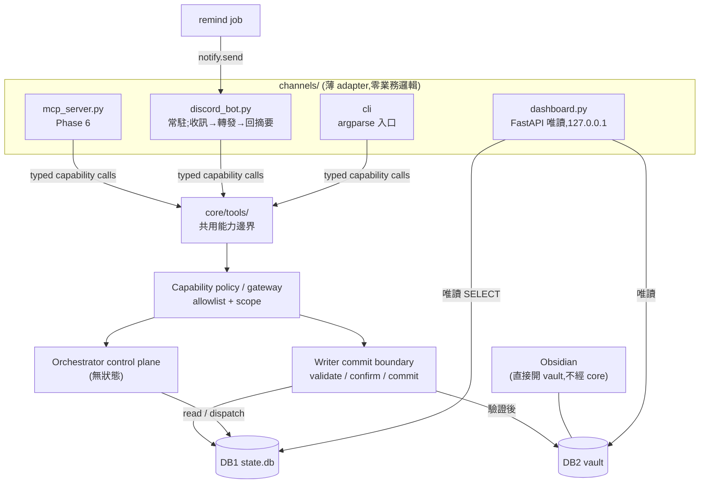
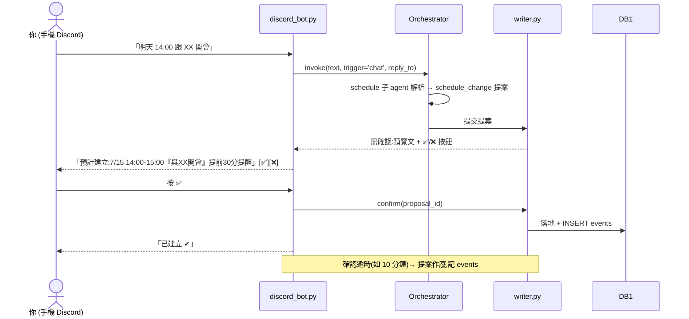

# MY AGENT — 使用介面文件(前端/後端)

> 本文件是介面層的設計權威;核心架構見 [ARCHITECTURE.md](ARCHITECTURE.md)。
> 鐵律:**介面 = 薄 adapter,零業務邏輯**。使用者能力共用 `core/tools/` typed
> capability layer；權限與暴露矩陣見 [docs/TOOLS.md](docs/TOOLS.md)。統一
> `application.invoke` 入口排在 part-006 slice-001，尚未宣稱已完成。
> channel 的長連線／UI session 只是 transport boundary；每則訊息仍建立獨立 core
> run。session 摘要與 OpenCode 對話只能作觀測訊號，不能取代 DB1/Beacon/vault
> 權威狀態。記憶契約見 [docs/MEMORY-zh.md](docs/MEMORY-zh.md)。

## 1. 介面矩陣(場景分工)

| 介面 | 場景 | 讀/寫 | 常駐? | 時程 |
|---|---|---|---|---|
| CLI | 開發、排程 job 入口 | 讀+寫 | 否(單次行程) | Phase 1-2 |
| Obsidian | 知識庫閱讀/編輯(vault 本身就是 UI) | 讀+寫(vault) | 使用者自開 | 零成本 |
| Discord bot | **出門**:提醒推播 + 排事情 + 快查 | 讀+寫(走 writer+確認) | 是(薄,無狀態) | Phase 2.5 |
| 網頁儀表板 | **在家**:一眼總覽 + 系統健康 | **唯讀** | 是(唯讀) | Phase 3.5 |
| MCP server | OpenCode / Claude Code 內查詢 | 唯讀優先 | 是 | Phase 6 |

分工一句話:**Obsidian 看知識、網頁看狀態、Discord 出門用、CLI 開發用、MCP 給其他 AI 用**。

## 2. 介面層架構



介面共用 `core/tools/` 的 `CapabilityContext` / `CapabilityResult`；CLI/Discord/MCP
已收斂到單一 invocation 入口(part-006 slice-001 已實作):

```python
def invoke(text: str, ctx: InvocationContext) -> InvocationResult: ...
# core/application.py:路由(排程/問答/確認)→ 執行 → agent_runs 記錄
# 確認走 stm.pending_claim 原子認領(併發雙確認只落地一次)
```

Capability tool call 不必全部繞回 orchestrator：read/propose/架構明定的 auto-apply
可由 gateway 依 policy 執行；shared-state commit 仍經 writer。這讓 Metatron 保持
control plane，而不是每個 tool call 的同步 data-plane proxy。

## 3. CLI(Phase 1-2,已在核心規劃)

- `python -m core.stm <domain> <verb>`:直接 CRUD(不經 LLM),開發與除錯用
- `python -m core.agent "<自然語言>"`:走完整 orchestrator 流程
- `python -m core.agent --job remind|consolidate`:排程入口
- 輸出:純文字到 stdout;錯誤碼非 0 = 失敗(排程器據此偵測)

## 4. Discord bot(Phase 2.5)

### 4.1 定位與安全

- **私人 server + bot 鎖定你的 user ID**:非白名單訊息一律不回應。它是你的私人終端,不是公開機器人
- 內容分級:行程/待辦/提醒/專案進度走 Discord;**深度知識查詢(recall 全文)留本機**——知識庫內容不必要地經過 Discord 伺服器
- 同時解掉「提醒通知管道」開放決策:`notify.send` 走 Discord DM,手機免費推播

### 4.2 技術

| 項 | 選 | 理由 |
|---|---|---|
| 套件 | `discord.py` | Python 同棧、成熟 |
| 形態 | 常駐 process(`channels/discord_bot.py`) | Discord gateway 需要 websocket |
| 狀態 | **無**——bot 掛了重啟,什麼都不丟(狀態全在 DB1) | 符合核心哲學 |
| token | `config.py` 走 `DISCORD_TOKEN` 環境變數 | 不落地 repo |

### 4.3 指令面(訊息即指令,不用 slash command 起步)

| 你打 | 發生什麼 |
|---|---|
| `明天 14:00 跟 XX 開會 提前30分提醒` | schedule 子 agent 解析 → 預覽 → 你按 ✅ → writer 落地 |
| `today` / `week` | 行程+待辦清單(唯讀,免確認) |
| `todo 買貓砂` | task_change 提案 → 預覽 → ✅ |
| `done 3` | 編號唯一時標記完成；task/schedule 撞號時要求 `done task 3` 或 `done schedule 3` |
| `proj` | projects 表摘要(phase/blockers/next) |
| (提醒到期) | bot 主動 DM 你:「14:00 會議,30 分鐘後」 |

### 4.4 寫入確認流(Discord 按鈕實作 §6.6 預覽+確認)



待確認提案存 DB1(新增輕量表或 cursors 复用,part-002.5 DESIGN 定)——bot 重啟不丟待確認項。

## 5. 網頁儀表板(Phase 3.5,唯讀)

### 5.1 定位

- **唯讀**。不做寫入:寫入會繞過預覽+確認流,且需認證/表單驗證,複雜度暴增
- 給「一眼總覽」:Obsidian 看不到的系統狀態(管線健康、記憶代謝、執行記錄)
- 借鑑 memory-river `mr-dash`:唯讀、綁 127.0.0.1、永不改資料

### 5.2 技術

| 項 | 選 | 理由 |
|---|---|---|
| 後端 | FastAPI(`channels/dashboard.py`) | Python 同棧、自帶 OpenAPI |
| 前端 | **一頁靜態 HTML + htmx**(或原生 fetch) | 一頁儀表板上 React 就是肥大的開始 |
| 綁定 | `127.0.0.1:7777`,無登入 | 本機自用;遷 VPS 後要遠端看再加 Tailscale/basic auth |
| 資料存取 | 唯讀 SQLite 連線(`mode=ro`)+ 唯讀讀 vault | 物理上不可能寫壞資料 |

### 5.3 API(全部 GET,唯讀)

| 端點 | 回傳 | 來源 |
|---|---|---|
| `GET /api/today` | 今日行程 + 到期待辦 `[{id,title,start_at,status}]` | schedule, tasks |
| `GET /api/projects` | `[{name,phase,blockers,next_action,updated_at}]` | projects |
| `GET /api/runs?limit=20` | 最近執行 `[{started_at,trigger,status,summary,error}]` | agent_runs |
| `GET /api/pipelines` | 各 sync 管線最後成功時間 + cursor 狀態 | cursors, agent_runs |
| `GET /api/memory` | events 統計:alive/trash/archived 數、健康值分布、inbox 待整理數 | events, vault |
| `GET /api/events?limit=50` | 最近事件流 `[{ts,actor,action,summary}]` | events |
| `GET /health` | `{ok: true}` | — |

### 5.4 頁面版塊(單頁)

```
┌─────────────────────────────────────────────┐
│ 今日行程/待辦        │ 專案進度 (phase/blockers) │
├─────────────────────┼───────────────────────┤
│ 管線健康             │ 記憶狀態                 │
│ threads ✅ 昨23:00   │ alive 132 / trash 8     │
│ x       ⚠ 3天未跑    │ inbox 待整理 17          │
│ fb      — 未啟用     │ 健康值分布 ▁▃▆█           │
├─────────────────────┴───────────────────────┤
│ 最近事件流 (events)  /  最近執行 (agent_runs)   │
└─────────────────────────────────────────────┘
```

## 6. MCP server(Phase 6;設計權威 `.beacon/parts/part-006/DESIGN.md`)

**核心用例:遠端接管開發迴圈**——人不在電腦前,讀「OpenCode 做到哪」+ 下
「下一步指令」。一套工具、兩種傳輸(薄 adapter 哲學)。

### 6.1 開發迴圈工具

| 工具 | 讀/寫 | 說明 |
|---|---|---|
| `dev_status([project])` | 讀 | 三源綜合:opencode.db(最近 session/todo)+ beacon.scan(CURRENT)+ git.scan |
| `session_tail(session_id?, n)` | 讀 | AI 剛做了什麼(最後 n 則對話摘要;opencode.db `mode=ro`) |
| `directive_push(project, text)` | 寫 | 下一步指令 → DB1 directives 佇列 |
| `directive_list([status])` | 讀 | 佇列現況 |

**指令閉環**:遠端 push → DB1 → 下次 OpenCode session 開場讀取(AGENTS.md 規則:
先跑 `python -m core.stm directives pending`)→ 標 consumed。不注入運行中 session
(脆弱);headless `opencode run` 遠端啟動為 VPS 後 backlog。

### 6.2 助理工具

`recall_query` / `schedule_list` / `task_list` / `project_status` /
`memory_rehydrate`(唯讀)+ `schedule_add` / `task_add`(寫 → pending + 預覽)
+ `confirm(pending_id, approve)`。**寫入必走 writer + 確認,不因 MCP 繞過**;
pending 在 DB1 共用 → MCP 發起、Discord 確認,跨介面一致。

### 6.3 兩種傳輸

- **slice-1 stdio**(本機,現可做):OpenCode 直接 spawn,零網路零認證
- **slice-2 HTTP/SSE**(VPS 後):綁 **Tailscale IP**(WireGuard 私有網路,
  不上公網);綁公網 IP → 啟動即拒絕(fail-closed)。Tailscale 下 recall 全文
  的內容分級(§4.1)解除

## 7. 介面層鐵律(全 channel 適用)

1. **零業務邏輯**:channel 只做收訊與回訊；能力在 `core/tools/`，解析、驗證、落地全在 core
2. **核心無狀態**:channel/UI session 可常駐，但每則訊息是獨立 run；channel 掛了
   重啟不丟資料，待確認提案持久化在 DB1
3. **寫入必走 writer + 確認**(done/查詢免確認);不因來源(Discord/網頁/MCP)開後門
4. **唯讀介面物理唯讀**:dashboard 用 `mode=ro` 連線
5. **秘密走環境變數**:DISCORD_TOKEN 等在 config.py 以 `*_env` 引用,不落地
6. **本機綁定預設**:dashboard/MCP 綁 127.0.0.1;上公網是顯式決定,不是預設

## 8. 建置時程(嵌入主 phase 計畫)

| 介面 phase | 依賴 | Gate | 狀態 |
|---|---|---|---|
| 2.5 Discord bot | Phase 2(orchestrator + writer 可用) | 手機發「明天開會」→ 預覽 → ✅ → DB1 有列;提醒 DM 收得到 | ✅ 程式面(真連線 QA 待 token) |
| 3.5 儀表板 | Phase 3(events/健康值有資料可看) | 開 localhost:7777 五版塊有真資料;寫入嘗試被 405 拒 | 📋 可插隊 |
| 6 MCP slice-1(stdio) | 無硬依賴(directives/octools 自帶) | `dev_status` 讀到真 session;`directive_push` → 新 session 開場讀到 | 📋 可插隊 |
| 6 MCP slice-2(HTTP) | VPS + Tailscale | 遠端 OpenCode 全工具通;綁公網拒絕測試綠 | 📋 gate: VPS |
